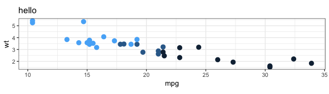

<!-- README.md is generated from README.Rmd. Please edit that file -->

# ggreverse

<!-- badges: start -->


<!-- badges: end -->

`ggreverse` takes a ggplot object and returns the code to create that
plot.

This package is written as a learning exercise to help me figure out the
internal structure of a ggplot object.

## Releases

  - `0.1.0` - initial release
  - `0.1.0` - improved theme handling

## ToDo

  - Reverse engineering of facetting and scales from a plot object.
  - `aes_string()` is currently unsupported.
  - Using tidyeval in `aes()` calls is currently unsupported.
  - Lots of other stuff :)

## Installation

You can install from [GitHub](https://github.com/coolbutuseless/) with:

``` r
# install.packages("remotes")
remotes::install_github("coolbutuseless/ggreverse")
```

## Example `ggreverse::convert_to_code()`

1.  Create a ggplot
2.  Convert the ggplot back into code using `ggreverse`
3.  Convert the code back into a plot

<!-- end list -->

``` r
library(ggreverse)

plot_df <- mtcars

# Create a ggplot2 plot object
p <- ggplot(plot_df) +
  geom_point(aes(mpg, wt, colour = cyl), size = 3) +
  labs(title = "hello") +
  theme_bw() + 
  theme(legend.position = 'none') + 
  coord_equal()
```



``` r
# Convert the plot object back into code
plot_code <- ggreverse::convert_to_code(p)
print(plot_code)
```

    #> ggplot(data = plot_df) +
    #>   geom_point(mapping = aes(x = mpg, y = wt, colour = cyl), size = 3, position = position_identity(), stat = "identity") +
    #>   labs(title = "hello", x = "mpg", y = "wt", colour = "cyl") +
    #>   theme_bw(11) +
    #>   theme(legend.position = "none") +
    #>   coord_fixed()

``` r
# Parse the plot code back into a plot - which should match the original plot
eval(parse(text = plot_code))
```


## SessionInfo

Developed against:

  - R 3.5.3
  - ggplot2 v3.1.1
